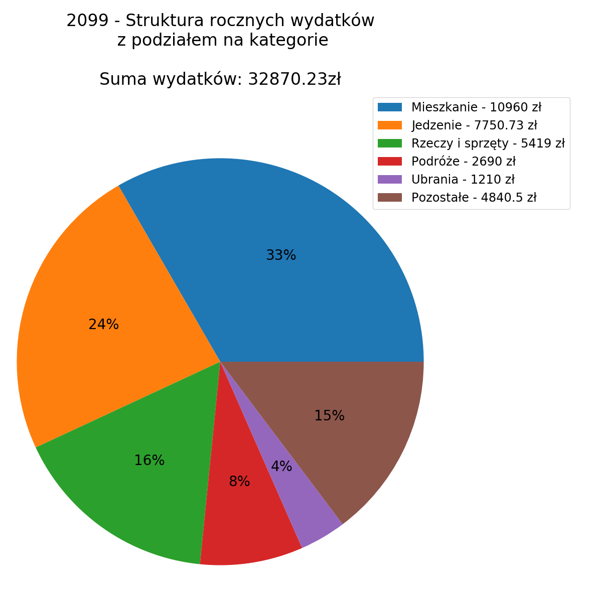
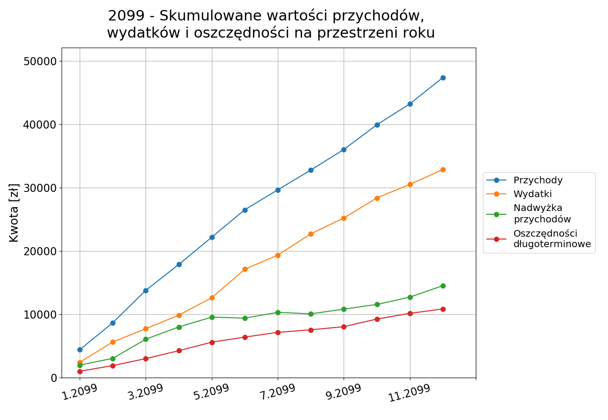
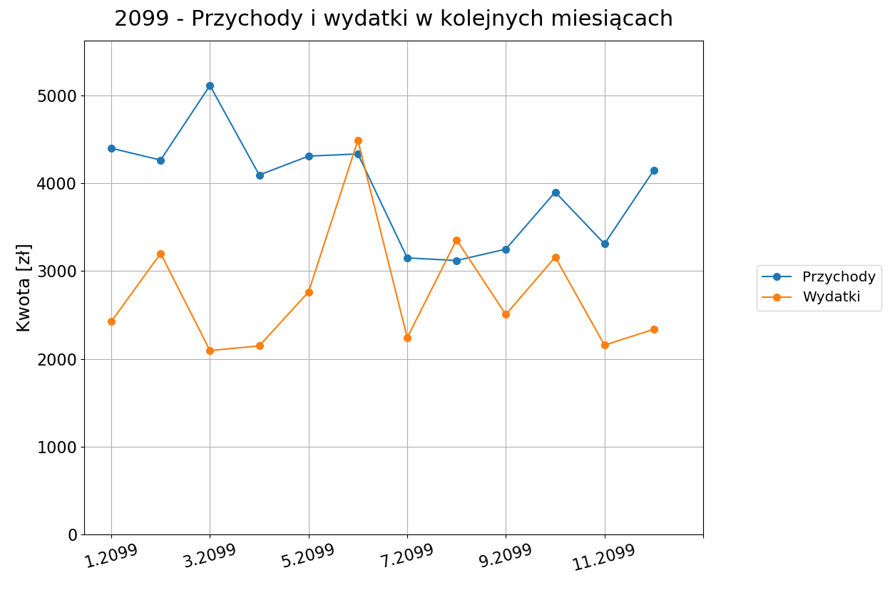

# Home Budget Calculator 

This is a program for analyzing and visualizing home budget. Input data is stored in excel worksheets which are to be filled manually by the user. A template with sample data (for 2099) can be found in data_and_results/ folder. There are four different analysis scenarios (described below). The output is a .pptx presentation and an .xlsx summary. The main need-to-know information is described below.  

### 1. Repository content

#### Folders

- data_and_results/  

  - !Reports/
  - monthly data/
  - total data/
  - yearly data/

  Directory for storing input data and output reports. Can be moved anywhere on the computer (see: Files -> path.txt)

- functions/

  - month_funcs/
  - part_funcs/
  - total_funcs/
  - year_funcs/

  - plotFuncs.py

  Directory for the functions used in subsequent scenarios (see: 2. Analysis scenarios)

- img/

  Contains exemplary images generated by the program 
  
- util_scripts/

  Directory for utility scripts for such actions as creating new month sheet from the template or copying a  filled sheet to yearly and total workbooks

####  Files

| Name               | Description                                                  |
| ------------------ | ------------------------------------------------------------ |
| classes.py         | File for classes used in the program                         |
| done.md            | Version history of the project                               |
| keywords.json      | Configuration file for spendingsFinder (see: 2. Analysis scenarios) |
| monthAnalysis.py   | Main script for a single month analysis scenario             |
| partAnalysis.py    | Main script for the analysis of a chosen period              |
| path.txt           | Here type absolute or relative path to your equivalent of data_and_results/ folder (anywhere on your computer) |
| spendingsFinder.py | Script which searches for a set of phrases in all spendings for a given period and presents them in tables |
| totalAnalysis.py   | Main script for the analysis of the whole registered period  |
| yearAnalysis.py    | Main script for a single year analysis scenario              |

### 2. Analysis scenarios

| Name          | Description                                                  |
| ------------- | ------------------------------------------------------------ |
| monthAnalysis | Analyzes and visualizes one month data                       |
| yearAnalysis  | Analyzes and visualizes one year data                        |
| totalAnalysis | Analyzes and visualizes all registered data - doesn't matter how many months |
| partAnalysis  | Analyzes and visualizes specified part of the total data     |

Additionally, there is a script called spendingsFinder.py. It allows to search the whole data for specific phrases in the specific period (see: keywords.json). The output is table with all spendings containing these phrases (see: data_and_results/!Reports/spendings_finder/).

The results of all of the scenarios are saved in data_and_results/!Reports/ (or equivalent directory).

### 3. How to run

#### 3.1. Month analysis

To run the month analysis enter the following code to cmd/terminal:

`python monthAnalysis.py mm yy` 

where _mm_ and _yy_ stand for month and year respectively. 

For example:

`python monthAnalysis.py 04 18`

is for April 2018. 

There is sample data attached to the code for Jan, Feb and Mar 2099 in data_and_results/monthly_data 
#### 3.2. Year  analysis

To run the year analysis enter the following code to cmd/terminal:

`python yearAnalysis.py yy` 

where _yy_ stands for year. 

For example:

`python yearAnalysis.py 18`

is for 2018. 

There is sample data attached to the code for 2099 in data_and_results/yearly_data 

#### 3.3. Total  analysis 

To run the total analysis enter the following code to cmd/terminal (without any arguments):

`python totalAnalysis.py` 

There is sample data attached to the code in data_and_results/total_data 

#### 3.4 Part analysis

To run the part analysis enter the following code to cmd/terminal:

`python partAnalysis.py mm_start yy_start mm_end yy_end` 

For example:

 `python partAnalysis.py 02 18 10 19`

is for the period from Feb 2018 to Oct 2018

#### 3.5 Spendings finder

To run the spendingsFinder enter the following code to cmd/terminal (without any arguments):

`python spendingsFinder.py`

 Update keywords and period in keywords.json beforehand.

### 4. Exemplary results

  

### 5. Dictionary

To understand variables naming better here is a brief dictionary of some nomenclature used: 

| Name           | Description                                                  |
| -------------- | ------------------------------------------------------------ |
| categories     | Arbitrarily chosen categories of spendings. They are specified in worksheets with input data and can be modified |
| metacategories | High-level arbitrarily chosen categories indicating type of spendings. There are three: one for basic spendings, one for additional (non-basic) and one for gifts, donations etc. |
| subcategories  | To specify type of the spendings for food category there are subcategories included to indicate what kind of food it is |
| incomes        | Money that comes in a given month                            |
| earnings       | Money that is earned in a given month                        |
| sources        | Sources of incomes/earnings                                  |
| balance        | Difference between incomes/earnings and spendings            |

### 6. More information

The project is described in details on the blog: 

https://ds-ml.blog/2019/09/10/kalkulator-budzetu-domowego-1-wprowadzenie/

